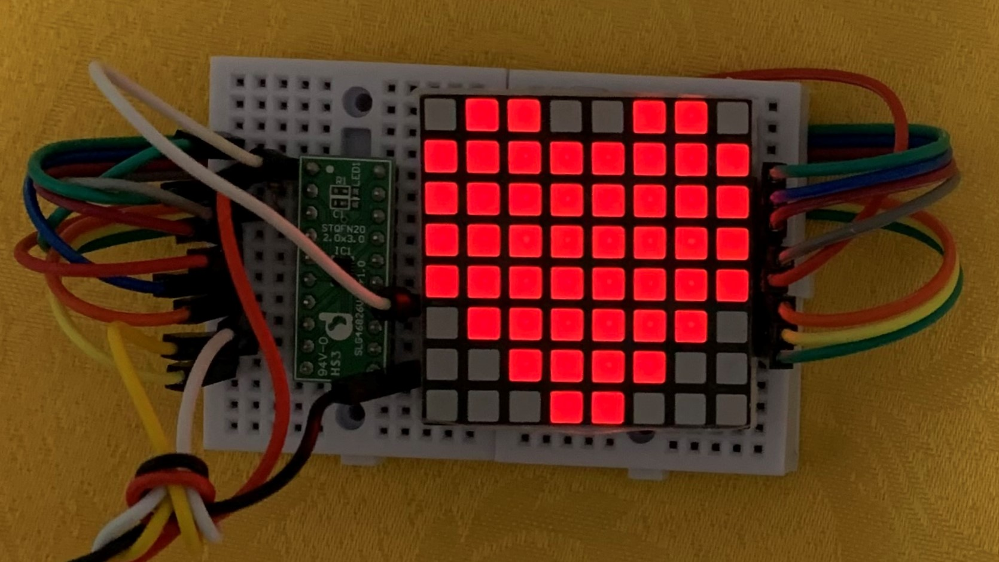
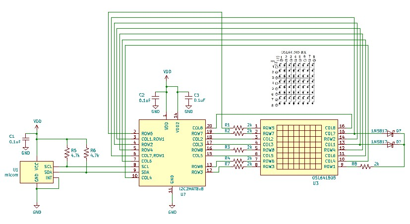
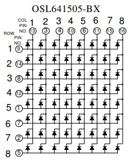
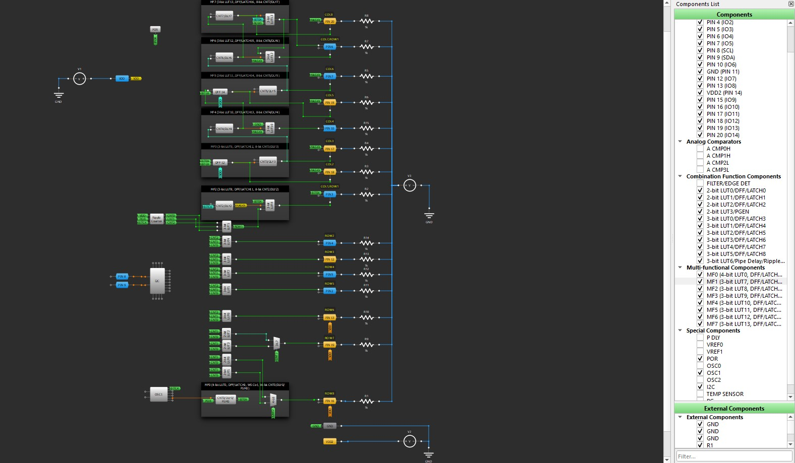

# 8x8 full matrix LED controller (緑豆弐拾参號改)  
  
GreenPAK用のデザインデータです。  
I2Cインタフェースで8x8ドットマトリクスLEDの制御を可能にします。  
SLG46826V(STQFN) または SLG46826G(TSSOP) に対応しています。SLG46826V-DIPに焼くこともできます。   

  

## 機能
- I2Cで8x8ドットマトリクスLEDの のドットをON/OFF可能  
- 明るさの調整が可能
- ダイナミック制御方式のため、点灯ドット数によらず明るさをほぼ一定にすることが可能

## 応用回路図

  

### Parts list
名称 | 型番等 | 個数 | 補足
--- | --- | --- | ---
GreenPAK | SLG46826V | 1  | 
Matrix LED | OSL641505-BB | 1  | 
DIODE SCHOTTKY | 1N5817 | 2  |
抵抗 | 2kΩ | 6  | 電流制限抵抗
抵抗 | 4.7kΩ | 2  | プルアップ抵抗
パスコン | 0.1uF | 3  | 

### 設計内容の補足
- 電流制限抵抗の値は、電源電圧やLEDの明るさに応じて適宜変更してください。  
GreenPAKが壊れる恐れがあるため、電流が20mA以下になるようにすることをお勧めします。

## ピンアサイン
ピン配置は OSL641505-BB や OSL641505-BRA と接続しやすいように設計してあります。  

  

### I2C2MAT8x8 
STQFN Pin # | TSSOP Pin # | 機能名 | IO | 内蔵抵抗 | SLG46826端子名 | 機能
--- | --- | --- | --- | --- | --- | ---
1 | 20 | VDD |  |  | VDD |  2.3V～5.5V
2 | 19 | COL8 | O | - | IO0 | to LED
3 | 18 | ROW1,COL1 | O | - | IO1 | to diode & LED
4 | 17 | ROW2 | O | - | IO2 | to LED via resistor
5 | 16 | ROW4 | O | - | IO3 | to LED via resistor
6 | 15 | ROW1,COL7 | O | - | IO4 | to diode & LED
7 | 14 | COL6 | I/O | - | IO5 | to LED
8 | 13 | SCL | I | - | SCL | SCL for SLG46826
9 | 12 | SDA | I/O | - | SDA | SDA for SLG46826
10 | 11 | COL4 | O | PU10k | IO6 | to LED
11 | 10 | GND |  |  | GND |  GND
12 | 9 | ROW3 | O | PU10k | IO7 | to LED via resistor
13 | 8 | ROW6 | O | PU10k | IO8 | to LED via resistorto LED via resistor
14 | 7 | VDD2 |  |  | VDD2 |  2.3V～5.5V
15 | 6 | COL5 | I/O | - | IO9 | to LED
16 | 5 | ROW8 | O | - | IO10 | to LED via resistor
17 | 4 | COL3 | I/O | - | IO11 | to LED
18 | 3 | COL2 | I/O | - | IO12 | to LED
19 | 2 | ROW7 | O | - | IO13 | to LED via resistor
20 | 1 | COL8 | O | - | IO14 | to LED


## コントロールレジスタ
I2Cアドレスは、0x08～0x0Bです。  
※I2Cアドレスを変更するには設計ツールでI2Cのプロパティを書き換えてください。  
I2Cアドレス0x08のI2Cレジスタを書き換えることでデバイスの動作を制御できます。  
I2Cアドレス0x09を用いても同じ動作になります。
I2Cアドレス0x0A~0x0Bは回路書換用に予約されていますので、不用意にアクセスを行わないでください。  
  
### コントロールレジスタ一覧
レジスタ一覧を下記に示します。  
  
address | W/R | default| bit | definition | corresponding block
--- | --- | --- | --- | --- | ---
0x90 | W | 0x1E | [7:0] | LED data for ROW8<BR>[7]: A7<BR>[6]: A6<BR>[5]: A5<BR>[4]: A4<BR>[3]: A3<BR>[2]: A2<BR>[1]: A1<BR>[0]: A0 | 2-bit LUT1<BR>2-bit LUT0
0x91 | W | 0x3F | [7:0] | LED data for ROW7<BR>[7]: B7<BR>[6]: B6<BR>[5]: B5<BR>[4]: B4<BR>[3]: B3<BR>[2]: B2<BR>[1]: B1<BR>[0]: B0 | 2-bit LUT3<BR>2-bit LUT2
0x92 | W | 0x00 | [7:0] | Do'nt care.<BR>If you write the value, please set it to 0x00.| 
0x93 | W | 0x00 | [7:0] | Do'nt care.<BR>If you write the value, please set it to 0x00.| 
0x94 | W | 0x7F | [7:0] | LED data for ROW6<BR>[7]: C7<BR>[6]: C6<BR>[5]: C5<BR>[4]: C4<BR>[3]: C3<BR>[2]: C2<BR>[1]: C1<BR>[0]: C0 | 3-bit LUT0
0x95 | W | 0xFE | [7:0] | LED data for ROW5<BR>[7]: D7<BR>[6]: D6<BR>[5]: D5<BR>[4]: D4<BR>[3]: D3<BR>[2]: D2<BR>[1]: D1<BR>[0]: D0 | 3-bit LUT1
0x96 | W | 0x7F | [7:0] | LED data for ROW4<BR>[7]: E7<BR>[6]: E6<BR>[5]: E5<BR>[4]: E4<BR>[3]: E3<BR>[2]: E2<BR>[1]: E1<BR>[0]: E0 | 3-bit LUT2
0x97 | W | 0x3F | [7:0] | LED data for ROW3<BR>[7]: F7<BR>[6]: F6<BR>[5]: F5<BR>[4]: F4<BR>[3]: F3<BR>[2]: F2<BR>[1]: F1<BR>[0]: F0 | 3-bit LUT3
0x98 | W | 0x1E | [7:0] | LED data for ROW2<BR>[7]: G7<BR>[6]: G6<BR>[5]: G5<BR>[4]: G4<BR>[3]: G3<BR>[2]: G2<BR>[1]: G1<BR>[0]: G0 | 3-bit LUT4
0x99 | W | 0x01 | [7:0] | LED data for ROW1<BR>[7]: H7<BR>[6]: H6<BR>[5]: H5<BR>[4]: H4<BR>[3]: H3<BR>[2]: H2<BR>[1]: H1<BR>[0]: H0 | 3-bit LUT5
0xAF | W | 0x01 | [7:0] | Brightness<BR>max : 1<BR>min : 61<BR>off : 62 | CNT2_data[7:0]
0xC8 | W | 0x00 | [7:0] | Software reset<BR>0x02: reset |
    
## 表示データ設定
光らせるドットに対応するビットに１を設定することで任意の記号を表示できます。  
ROWおよびCOLとドット位置の対応を以下に示します。

|ROW|8|7|6|5|4|3|2|1|COL|
|---|---|---|---|---|---|---|---|---|:---:|
||A0|B0|C0|D0|E0|F0|G0|H0|**0**|
||A1|B1|C1|D1|E1|F1|G1|H1|**1**|
||A2|B2|C2|D2|E2|F2|G2|H2|**2**|
||A3|B3|C3|D3|E3|F3|G3|H3|**3**|
||A4|B4|C4|D4|E4|F4|G4|H4|**4**|
||A5|B5|C5|D5|E5|F5|G5|H5|**5**|
||A6|B6|C6|D6|E6|F6|G6|H6|**6**|
||A7|B7|C7|D7|E7|F7|G7|H7|**7**|

また、♥の表示に対応するHEX値の計算例を以下に示します。  
アルファベットなど他の例は、I2C2MAX8x8.xlsx をご参照ください。  

||A|B|C|D|E|F|G|H|bit|
|:-:|:-:|:-:|:-:|:-:|:-:|:-:|:-:|:-:|:-:|
||0|1|1|0|0|1|1|0|**0**|
||1|1|1|1|1|1|1|1|**1**|
||1|1|1|1|1|1|1|1|**2**|
||1|1|1|1|1|1|1|1|**3**|
||1|1|1|1|1|1|1|1|**4**|
||0|1|1|1|1|1|1|0|**5**|
||0|0|1|1|1|1|0|0|**6**|
||0|0|0|1|1|0|0|0|**7**|
|**DEC**|30|63|127|254|254|127|63|30||
|**HEX**|0x1E|0x3F|0x7F|0xFE|0xFE|0x7F|0x3F|0x1E||


## 明るさ
コントロールレジスタのアドレス0xAFで明るさを変えられます。1で明るさ最大、61で明るさ最小、62で消灯です。  

## ソフトウェアリセット
コントロールレジスタのアドレス0xC8に0x02を書き込むことで、SLG46826にリセットをかけることができます。  
リセット後はSLG46826が初期化され、端子設定やレジスタ設定などが初期状態に戻ります。  
リセット状態は自動的に解除されるので、0x00を送りなおす必要はありません。  
  
## 設計データ
「GreenPAK6 Designer」で  
I2C2NAT8x8.gp6  
を開き、SLG46826V またはSLG46826Gに焼いてください。  
LUTの初期値は電源投入直後に♥を表示するように設定されています。変更する際は、レジスタ一覧の対応ブロックの情報を参考にLUTの初期値をお好きに変更して下さい。  
SLG46826G に焼く場合は、File-Project info で Packageを「TSSOP-20」に変更してください。この場合、LEDと端子の対応が左右反転しますが、ピッチ変換基板を裏返しに使うなどSLG46826Gを左右反転にすることで、設計データをそのまま使うことができます。  

設計データ外観  
  

## サンプルコード
M5SticCPlus用に作成したそろばん表記式時計のソースコードを公開します。  
[mat8x8_abacus.ino](/src/mat8x8_abacus/mat8x8_abacus.ino)  
  
起動すると以前接続したSSIDのWi-Fiに接続し、NTPサーバから現在時刻を取得します。  
もし、接続できない場合は、  
```
char wifi_ssid[33]    = "";
char wifi_passwd[65]  = ""; 
```
にSSIDとパスワードを直接記述してください。

### 動作デモ
https://user-images.githubusercontent.com/42811276/148972316-9eaea1f4-95b0-4ff6-93d8-ebf1e2f3cea9.mp4
    
## 免責事項
当方は、利用者に対して、このデザインおよびこの資料（以下、本デザイン等）に関する当方または第三者が有する著作権、特許権、商標権、意匠権及びその他の知的財産権をライセンスするものではありませんし、本デザイン等の内容についていかなる保証をするものでもありません。また当方は、本デザイン等を用いて行う一切の行為について何ら責任を負うものではありません。本デザイン等の情報の利用、内容によって、利用者にいかなる損害、被害が生じても、当方は一切の責任を負いません。ご自身の責任においてご利用いただきますようお願いいたします。   
  
  
## Author  
[GitHub/AoiSaya](https://github.com/AoiSaya)  
[Twitter ID @La_zlo](https://twitter.com/La_zlo)  
